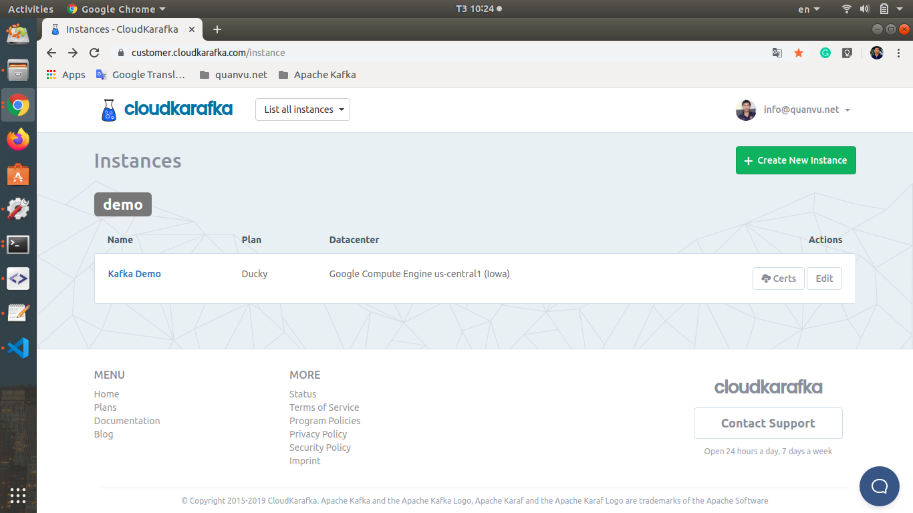
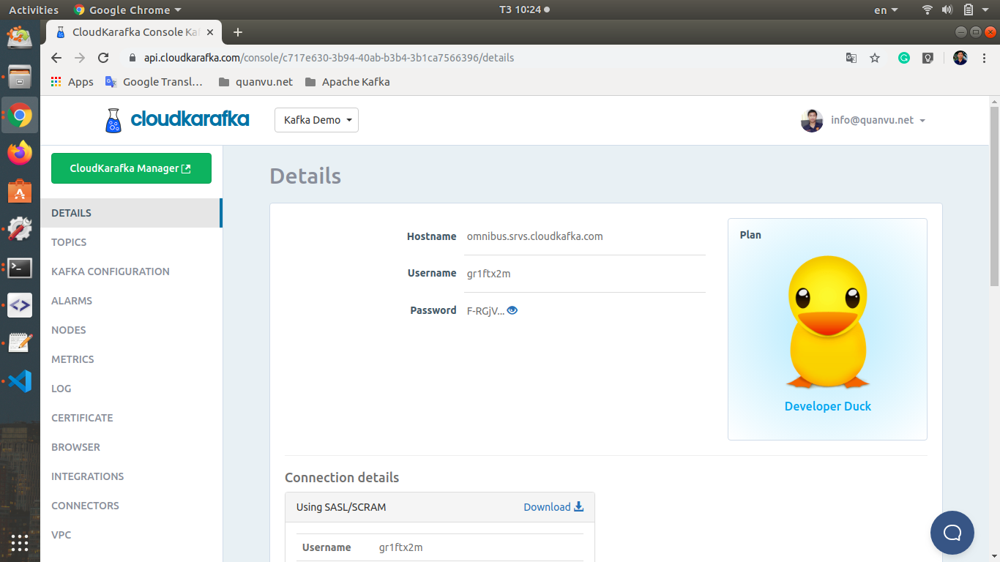

# Apache Kafka example for Python

Demonstration for using Apache Kafka on Cloudkarafka.com which is a real-time message streaming as a service. Powered by Apache Kafka. Fully managed, epic performance & superior support.

## Getting started

1. First, we need to register a new cloudkarafka account and create a new Apache Kafka instance, for me i named it as "Kafka Demo".

    


2. Open "Kafka Demo" instances to open details page, you will see "Connection details" below let download it as kafka_demo_connection.txt.

    

3. Setup 

    Open kafka_demo_connection.txt you will see the configuration like this:

    * `export CLOUDKARAFKA_BROKERS="host1:9094,host2:9094,host3:9094"`
    Hostnames can be found in the Details view in for your CloudKarafka instance.
    * `export CLOUDKARAFKA_USERNAME="username"`
    Username can be found in the Details view in for your CloudKarafka instance.
    * `export CLOUDKARAFKA_PASSWORD="password"`
    Password can be found in the Details view in for your CloudKarafka instance.
    * `export CLOUDKARAFKA_TOPIC="username-topic"`
    Topic should be the same as your username followed by a dash before the topic.

    These export commands must be run in both of the terminal of consumer and producer below.

    **Create new virtual python environment for this demo**

    ```
    cd python-cloudkarafka
    virtualenv -p python3 venv
    source venv/bin/activate
    pip install confluent_kafka
    ```

4. Create a Consumer

    Open another terminal window and run this command to create a new consumer:

    ```
    cd python-cloudkarafka
    python consumer.py
    ```

5. Create a Producer

    Open another terminal window and run this command to run producer:

    ```
    cd python-cloudkarafka
    python producer.py
    ```

    Let enter some text, it will be send to consumer (in consumer terminal window).


## Adding a Root CA (if you are seeing the error)

In some cases the CloudKarafka Root CA may need to be manually added to the example, particularly if you are seeing the error:
```
Failed to verify broker certificate: unable to get local issuer certificate 
```
returned when you run the example. If this is the case you will need to download the [CloudKarakfa Root CA](https://www.cloudkarafka.com/certs/cloudkarafka.ca) (See also the [FAQ](https://www.cloudkarafka.com/docs/faq.html)) and place it in the python-kafka-example directory, then add the following line into the `conf {...}` section:
```
'ssl.ca.location': 'cloudkarafka.ca'
```
This should resolve the error and allow for successful connection to the server.
