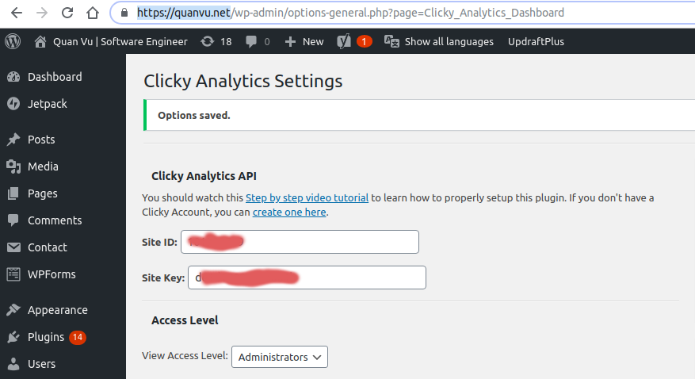
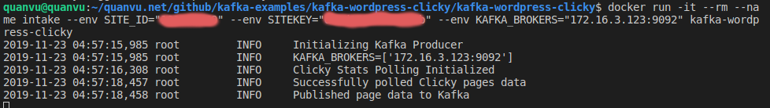
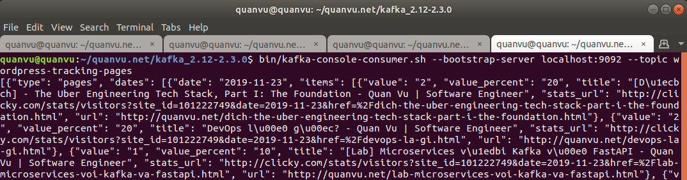

# Kafka Wordpress Clicky

Trong hướng dẫn này mình sẽ hướng dẫn các bạn cấu hình Kafka để  theo dõi dữ liệu từ Clicky.com cho website sử dụng Wordpress.

Mục đích của bài hướng dân này là:

- Học cách tích hợp Apache Kafka sử dụng thư viện kafka-python.
- Cài đặt clicky để  theo dõi hành động người dùng trong wordpress.

## Hướng dẫn

Giả sử rằng bạn đã đăng ký một tài khoản Clicky.com cho một website sử dụng wordpress của bạn. Hiện tại mình đang sử dụng wordpress cho [Tech Blog của mình](https://quanvu.net/) vì thế mình cần theo dõi hành vi người dùng, các bài viết và các chủ để (topic) mà được mọi người quan tâm nhiều nhất từ đó nâng cao chất lượng bài viết tập trung hơn.

#### Bước 1: Cài đặt Clicky plugin cho Wordpress

Clicky plugin cho Wordpress có tên là **Clicky Analytics**.

1. Open Menu: Plugin -> Add new 
2. Nhập: Clicky Analytics
3. Cài đặt và active plugin này.
4. Tìm plugin và chọn setting để cấu hình: SITE_ID và SITE_KEY

Sau khi bạn cài đặt plugin Clicky Analytics hãy theo hướng dẫn để tìm SITE_ID và SITE_KEY.



#### Bước 2: Start Apache Kafka

Để cài đặt Apache Kafka bạn hãy bắt đầu với Quickstart từ trang chủ của Kafka tại đây:
[https://kafka.apache.org/quickstart](https://kafka.apache.org/quickstart)

Giả sử bạn đã học được cách cài đặt, khởi động và tạo một topic trong Kafka. Tiếp theo bạn hãy làm theo hướng dẫn sau để hoàn thành bài thực hành này:

1. Start Kafka server

Open new termial and run this command to start zookeeper server:

```
$ cd kafka_2.12-2.3.0
$ bin/zookeeper-server-start.sh config/zookeeper.properties
```

Open new termial and run this command to start kafka server:

```
$ cd kafka_2.12-2.3.0
$ bin/kafka-server-start.sh config/server.properties
```

Mặc định Kafka start trên port: 9092

2. Tạo mới Topic

```
$ cd kafka_2.12-2.3.0

# Tạo một topic
$ bin/kafka-topics.sh --create --bootstrap-server localhost:9092 --replication-factor 1 --partitions 1 --topic wordpress-tracking-pages

# Kiểm tra topic đã tạo
$ bin/kafka-topics.sh --list --bootstrap-server localhost:9092

# Delete a topic
# bin/kafka-topics.sh --delete --bootstrap-server localhost:9092 --topic <your_topic>
```

3. Chạy Kafka consumer to subscribe toipc

```
$ cd kafka_2.12-2.3.0
$ bin/kafka-console-consumer.sh --bootstrap-server localhost:9092 --topic wordpress-tracking-pages
```

#### Bước 3: Kafka tracking Clicky cho Wordpress

Tiếp theo chúng ta sẽ Clicky app của chúng ta:

```
git clone git@github.com:quan-vu/kafka-examples.git
$ cd kafka-wordpress-clicky
$ docker build -t kafka-wordpress-clicky .
$ docker run -it --rm --name intake --env SITE_ID="{your_clicky_site_id" --env SITEKEY="{your_clicky_sitekey}" --env KAFKA_BROKERS="<your_local_ip_addr>:port" kafka-wordpress-clicky
```

Find your local ip address:

```
$ ifconfig
# Ip của mình là: 172.16.3.123
```

Ví dụ:

```
# docker run -it --rm --name intake --env SITE_ID="xxxxxxxxx" --env SITEKEY="xxxxxxxxxxxx" --env KAFKA_BROKERS="172.16.3.123:9092" kafka-wordpress-clicky
```

Kết quả start kafka-wordpress-clicky image thành công:




Sau khi chạy kafka-wordpress-clicky docker image, bạn hãy open Consumer terminal ở trên để  theo dõi sự thay đổi, lúc này kafka sẽ nhận được dữ liệu từ clicky một cách tự động. Từ đó bạn có thể handle business logic bất kỳ nếu muốn.



## Tham khảo

Bài viết được tham khảo từ tutorial serie [Kafka Tutorial for Fast Data Architecture](https://dzone.com/articles/kafka-tutorial-for-fast-data-architecture)